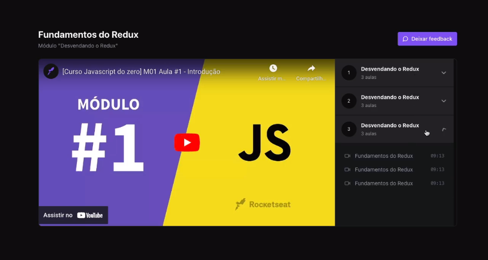

<h1 align="center">Redux zustand </h1>

nesse curso aprendi a fazer um player de video trocando aulas e trocando materias  

  <a href="#-tecnologias">Tecnologias</a>&nbsp;&nbsp;&nbsp;|&nbsp;&nbsp;&nbsp;
  <a href="#memo-licença">Licença</a>

  

 

   

## 🚀 Tecnologias

Esse projeto foi desenvolvido com as seguintes tecnologias:

- typescript
- Git e Github
- Redux
- tailwindcss
- zustand

## :memo: Licença

Esse projeto está sob a licença MIT.

---

Feito com ♥ by Rocketseat :wave:
